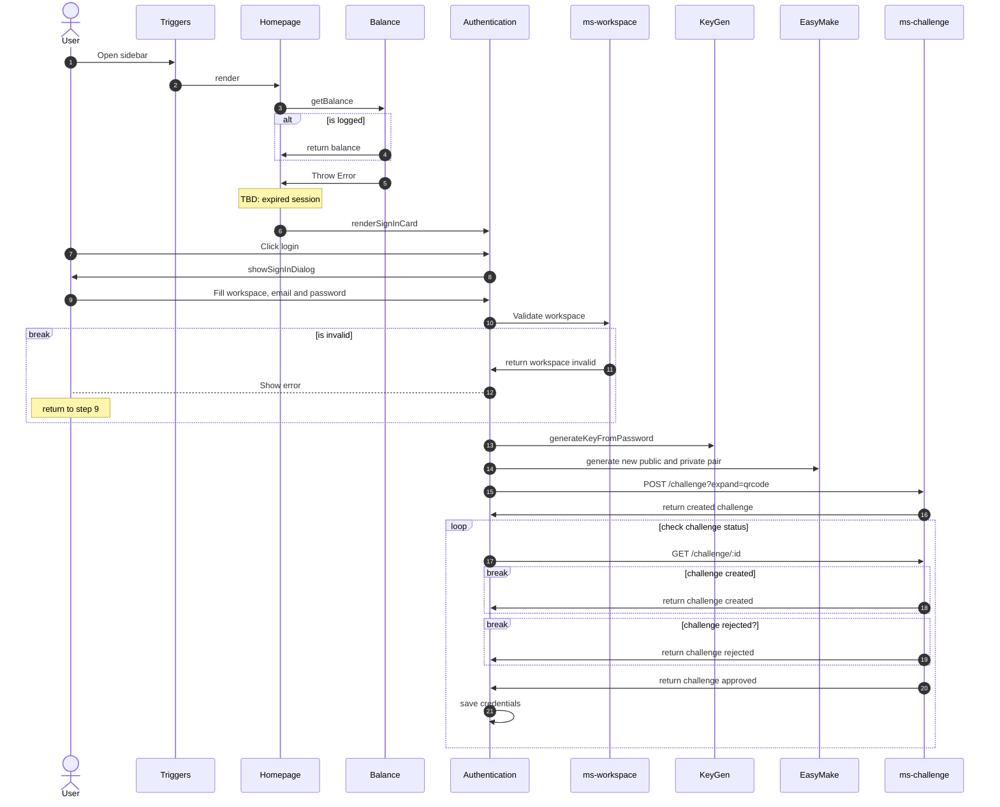

# Login Sequence

```mermaid
sequenceDiagram
    autonumber
    Actor User
    User ->>Triggers: Open sidebar
    Triggers ->> Homepage: render
    Homepage ->> Balance: getBalance
    alt is logged
        Balance ->> Homepage: return balance
    end
    
    Balance ->> Homepage: Throw Error
    note over Homepage: TBD: expired session
    Homepage ->> Authentication: renderSignInCard
    User ->> Authentication: Click login
    Authentication ->> User: showSignInDialog
    User ->> Authentication: Fill workspace, email and password
    Authentication ->> ms-workspace: Validate workspace
    break is invalid
        ms-workspace ->> Authentication: return workspace invalid
        Authentication --> User: Show error
        note over User: return to step 9
    end
    Authentication ->> KeyGen: generateKeyFromPassword
    Authentication ->> EasyMake: generate new public and private pair
    Authentication ->> ms-challenge: POST /challenge?expand=qrcode
    ms-challenge ->> Authentication: return created challenge
    
    loop check challenge status
        Authentication ->> ms-challenge: GET /challenge/:id
        break challenge created
            ms-challenge ->>Authentication: return challenge created
        end
        break challenge rejected?
            ms-challenge ->>Authentication: return challenge rejected
        end
        
        ms-challenge ->> Authentication: return challenge approved
        Authentication ->> Authentication: save credentials
    end
```